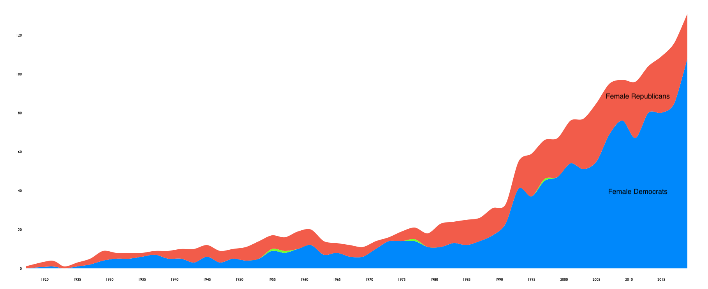
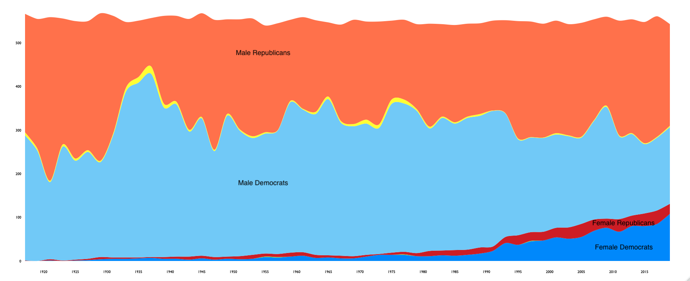

### Female representation in US federal electoral politics

#### Figure 1 – Acquiring the data

The gender prediction algorithm's accuracy was cross-validated with an annotated dataset from Propublica, and its estimate for the proportion 
of women in the dataset was within 2% of the actual value.

#### Figure 2 – Female representation in Congress, split by party

82% of the total number of women in Congress are democrats, versus 55% back in 1989.

#### Figure 3 – Gender representation in Congress, by party

The proportion of democrats that are women is of 38%, whereas women only make up 9% of elected republicans.

